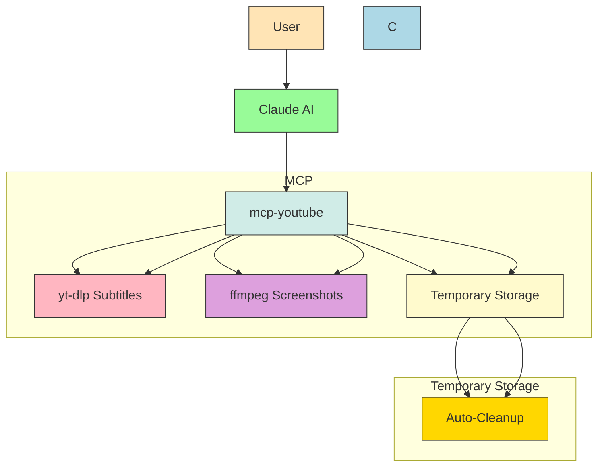

# YouTube MCP Server

This project connects YouTube video processing capabilities to Claude AI via the [Model Context Protocol](https://modelcontextprotocol.io/introduction). It uses `yt-dlp` for downloading subtitles and `ffmpeg` for screenshot extraction. Users can ask Claude to summarize YouTube videos by providing the URL.

## System Architecture Diagram



## Getting Started

### Prerequisites
- `yt-dlp` and `ffmpeg` installed (via Homebrew, WinGet, or other package managers)
- Node.js and npm installed

### Installation
1. Install the MCP server:
   ```bash
   npm install -g @novemberde/mcp-youtube
   ```

2. Configure Claude to use the MCP server:
   Add the following to your `claude_desktop_config.json`:
   ```json
   {
     "mcpServers": {
       "mcp-youtube": {
         "command": "npx",
         "args": ["@novemberde/mcp-youtube"]
       }
     }
   }
   ```

## Available Tools

### 1. `download_youtube_url`
Downloads and extracts subtitles from a YouTube video.

**Parameters:**
- `url` (required): YouTube video URL

**Example:**
```json
{
  "url": "https://www.youtube.com/watch?v=example"
}
```

### 2. `search_youtube_videos`
Searches YouTube videos based on a query.

**Parameters:**
- `query` (required): Search term
- `max_results` (optional, default=10): Maximum number of results

**Example:**
```json
{
  "query": "how to make pizza",
  "max_results": 5
}
```

**Returns:**
- Video title, URL, description, duration, view count, uploader name

### 3. `get_screenshots`
Captures screenshots from specific timestamps of a YouTube video.

**Parameters:**
- `url` (required): YouTube video URL
- `timestamps` (required): Array of timestamps in `HH:MM:SS` format

**Example:**
```json
{
  "url": "https://www.youtube.com/watch?v=example",
  "timestamps": ["00:01:30", "00:05:45"]
}
```

**Returns:**
- File paths to saved screenshots

## Notes
- Ensure `yt-dlp` and `ffmpeg` are installed globally.
- The server uses temporary directories for processing, which are automatically cleaned up.
- Error handling provides descriptive messages for troubleshooting.

## Contributing
Contributions are welcome! Please:
1. Fork the repository
2. Create a feature branch (`git checkout -b feature/your-feature`)
3. Commit your changes (`git commit -am 'Add some feature'`)
4. Push to the branch (`git push origin feature/your-feature`)
5. Create a new Pull Request

## License
This project is licensed under the MIT License - see the [COPYING](COPYING) file for details.
